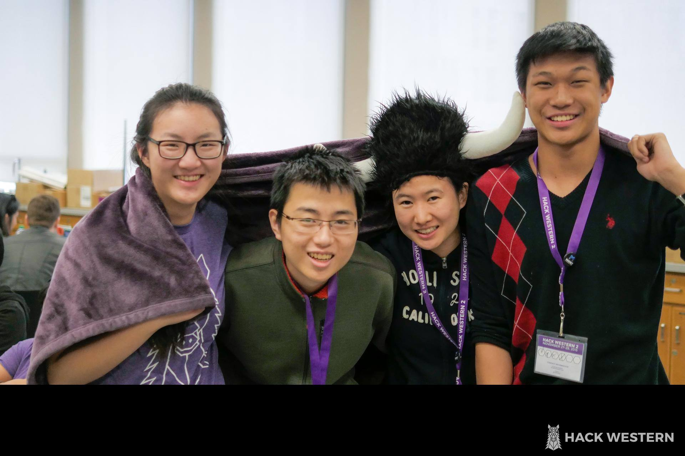
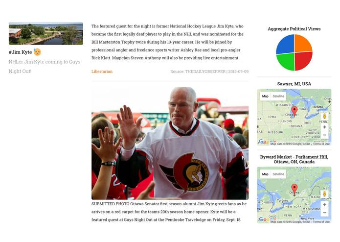

## Introduction

This weekend, I attended Hack Western with a few of my SHAD friends (Kevin, Lilian, and Katherine).
It was a really great experience and we even came home with a sponsor prize! Going into Hack
Western, I am pretty sure that my team had zero idea of how to proceed from our initial idea. A week
before Hack Western, Kevin had a really great idea of a live-updated trend-based news-aggregator web
application. Essentially what it did was scrape a bunch of articles related to a specific trend and
find the top keywords from all the articles. Then it would determine the best paragraphs from the
best sources based on length, conciseness, views, and factual information. The paragraphs would be
pushed to [Firebase](http://firebase.com/) which was finally pulled and displayed on the website.

## APIs

So you are probably thinking the same thing as we did when we started the hackathon: _how the
**hell** are we supposed to do that?_ Well it turns out that the process was relatively simple once
we got the ball rolling. The first we did was split up into groups; Kevin started designing and
working on the frontend while Lilian, Katherine, and I sorted everything out on the backend. We
decided to use Python because it was one of the most intuitive languages to use.

Our first big issue was how we were going to get the trends. In the end, we decided to pull them
from Twitter's trending hashtags using its [API](https://dev.twitter.com/rest/public). The only
problem was that hashtags were one word and we were afraid that we wouldn't be able to pick up any
relevant articles. I attempted to use a greedy substring matching algorithm and
[Aho-Corasick](https://github.com/jeffrey-xiao/Competitive-Programming/blob/master/src/codebook/string/AhoCorasick.java)
to try to split the hashtags into phrases. However, there were too many "valid" phrases and
exhaustively searching news articles for each phrase would be computationally heavy and yield too
many of the same results. After brooding long and hard over the issue, we decided to screw it and
directly search for the hashtag.

Next up, we used [Bing's Search API](http://datamarket.azure.com/dataset/bing/search) to find the
top thirty news articles. That step was pretty simple -- we used some code we found on StackOverflow
for the API to work with Python. After that, we found a nice web scraper tool in Python called
[Newspaper](https://github.com/codelucas/newspaper). Now we were getting down to the nitty-gritty of
actually processing the articles. We used [Indico](https://indico.io/) to determine the keywords for
each paragraph.

## Algorithmic Magic

Then we encountered our second big issue: **how are we supposed to determine the best articles
without repeating facts and getting the entire picture?**

I came up with a great idea of creating a bipartite graph using the paragraphs and keywords as
nodes. Maximal matching will then determine the minimum number of paragraphs that could cover all
the content. Of course, this process might yield irrelevant results so we only used the most
frequent keywords. After implementing
[Kuhn's algorithm](https://github.com/jeffrey-xiao/Competitive-Programming/blob/master/src/codebook/graph/network/MaxBipartiteMatchingKuhn.java)
(it was a surprise that I still knew how it worked!), we tested our program and it yielded pretty
nice results.



**Whew!** A big portion of our backend was completed at this point. We checked the time and to our
surprise, only 11 hours had passed -- we still had over two-thirds of the hackathon left. The
simplicity of Python (especially its imports) really helped especially since we were using so many
APIs.

```python
import urllib2
import json
import Queue
import indicoio
from firebase import firebase
from random import shuffle
from twitter import *
from newspaper import Article
import wolframalpha
import simplejson
import os
import sys
import struct
import imghdr
import time
from BeautifulSoup import BeautifulSoup
from googleplaces import GooglePlaces, types, lang
```

_<center>The list of imports we had at the beginning of our Python script.</center>_

## Data Visualization and Images

The great thing about Indico is that it also gave us entities, political sentiment, and positivity.
We used the entities, [Wolfram Alpha API](http://products.wolframalpha.com/developers/), and
[Google Places API](https://developers.google.com/places/) to obtain some location information about
the paragraphs. We used the next few hours to create pretty data visualizations with the political
sentiments, and positivity measure. We spent the next eight hours in the hackathon working on the
user interface, incorporating all the information, and finalizing our algorithm to select the best
paragraphs.

Staying up for nearly 24 hours, I fell asleep soon after. To my surprise when I woke up, my team had
gotten image extraction working. Using
[BeautifulSoup](http://www.crummy.com/software/BeautifulSoup/), they were able to find images by
locating the `` tag. However, that extracted all the images from a webpage (even the ones on
the side and navigation bars), so they used the `alt` attribute to determine if an image was
relevant.

## Conclusion

The rest of the hackathon was rather unproductive since we had pretty much finished. Kevin used
[Ionic](http://ionicframework.com/) to port _In the Loop_ to Android and iOS. I thought that we had
a pretty good shot at a couple of the prizes (Best Data Visualization, Best Life Hack, Best Open
Source, and Best Social Impact), but after seeing the other projects I was unsure. I really wanted
the Best Social Impact prize since they were giving out Bluetooth headphones. In the end, we got the
Best Life Hack prize which was a pleasant surprise. Overall, Hack Western was a great experience and
I was really happy that we built such a functional and well-designed web application in just 36
hours! I learned a lot about the different APIs out there, and especially how powerful Indico is!

Check out [In the Loop](http://beintheloop.me/) in action!
