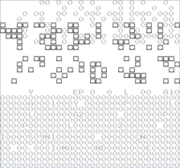
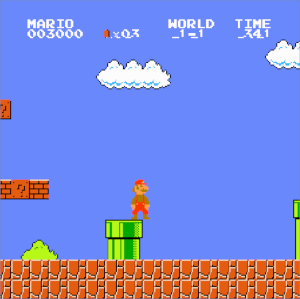
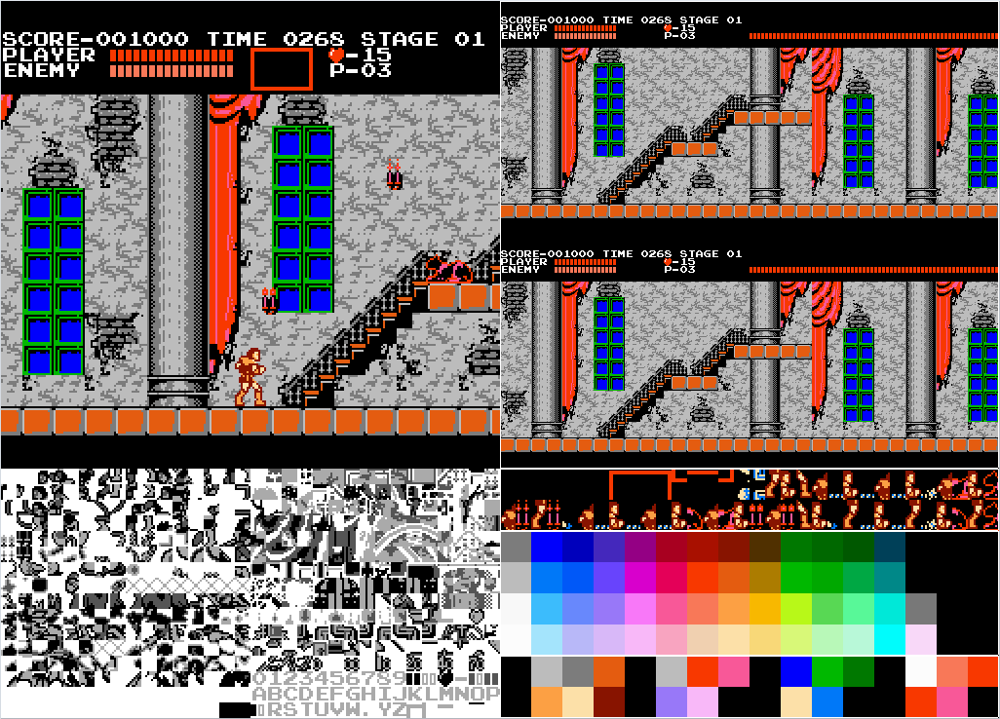

## Introduction

Over the past month, I tried my hand at emulating the Nintendo Entertainment System and I wanted to
share my personal experience creating `neso-rs` and some advice to those wanting to make their own.
My final goal was to compile the project to WebAssembly so that the emulator can be run on the web,
so I will also share my thoughts on the WebAssembly ecosystem.

Links to the source code:

- [Web frontend](https://github.com/jeffrey-xiao/neso-web)
- [SDL2 frontend](https://github.com/jeffrey-xiao/neso-gui)
- [Core NES crate](https://github.com/jeffrey-xiao/neso-rs)

## CPU

Implementing the CPU is definitely the first task to complete when building an NES emulator from
scratch. The CPU is a MOS 6502 CPU with the BCD mode stripped off. For me, the CPU was the easiest,
but least interesting component of the NES. The MOS 6502 is well documented and even a transistor
level emulator even exists, so it was fairly easy to implement the addressing modes, and the
instructions. I mainly used [Obelisk's 6502 Reference](http://www.obelisk.me.uk/6502/reference.html)
for most of my implementation. There are some quirks to the CPU (timing when indexing crosses a page
boundary, `JMP` bug), but these are also all well documented. I did not make a subcycle accurate
CPU, but there are a variety of ways to do so: generating a finite state machine, using co-routines,
or using a queue of tasks that each take one cycle.

## Cartridge and NROM

To actually get started on testing, it was necessary to implement Mapper 0 (NROM) and logic for
parsing cartridges. Overall, mapper 0 and handling iNES cartridges were straightforward, and I did
not have much trouble in this step. After I had the same logs as Nintendulator for `nestest`, I
moved on to the next component.

## PPU

The PPU is a big step in difficulty from the CPU for a beginner in emulator development like me. It
took several days to understand how the different components of the PPU worked together. I found
this series of [articles](http://www.dustmop.io/blog/2015/04/28/nes-graphics-part-1/) to be
_extremely_ useful to get started on the PPU. Here are the general steps I took to get a decently
working PPU:

1. Implement memory mapping and PPU registers.
2. Render pattern tables at the end of each frame.
3. Render nametables at the end of each frame.
4. Implement the background rendering pipeline.
5. Implement the sprite evaluation and fetching pipeline.

## Mappers

After the PPU, I decided to put off learning about the APU to instead implement more mappers. With
the exception of MMC2 and MMC5, the most complicated logic components for popular mappers are
PRG/CHR ROM banking and generating interrupts, which are not too bad to implement. I have not gotten
around to implementing MMC2 because I didn't have a great way of snooping PPU reads, and MMC5
because of its complexity.

## APU

I initially thought the APU would be more difficult to reason with than the PPU because I had no
experience with audio programming. After all, outputting a signal that you can hear _seemed_
significantly harder than putting pixels on a screen. Sure NESDEV had great documentation on the
different sound channels (Pulse, Triangle, Noise, and DMC), but I didn't know where to get started.
I had to gather a couple of observations before I fully understood how to produce sounds:

1. Seeing the [oscilloscope view](https://www.youtube.com/watch?v=OfrEoEQpPrI) of the chiptune music
   was useful to see what sounds each channel produced.
2. The APU outputs at a frequency of ~1.78 mHz, but most PC sound cards operate at 44.1 kHz or 48
   kHz, so downsampling is required. In other words, if you wanted to downsample to 44.1 kHz, you
   would record the output of the APU every 1.78 mHz / 44.1 kHz = ~40 cycles. Additionally, every
   frame you would have a buffer of 44.1 kHz / 60 Hz = 735 samples since the NES ran at 60 frames
   per second.
3. After the analog audio signals of the channel outputs were combined, the combined signal goes
   through a first order high-pass filter at 90 Hz, another first order high-pass filter at 440 Hz,
   and finally a first order low-pass filter at 14 kHz. A high-pass filter attenuates all
   frequencies lower than the specified frequency, while a low-pass filter attenuates frequencies
   higher than the specified frequency. These first order filters can be realized using a simple RC
   circuit and their algorithmic implementations can be found on their respective
   [Wikipedia](https://en.wikipedia.org/wiki/High-pass_filter)
   [pages](https://en.wikipedia.org/wiki/Low-pass_filter). I assume these filters are needed to
   reduce [aliasing](https://en.wikipedia.org/wiki/Aliasing).

After combining these observations, the rest of the process was not complicated. Using the
information on NESDEV, I was able to implement the different channels and was able to play sounds
using `AudioQueue` in `sdl2`, or `BufferSourceNode` in `WebAudio`.

## Compiling to WebAssembly

With no exaggeration, compiling the project to WebAssembly was the easiest step because of how great
the documentation and toolchain are. The [Rust Webassembly book](https://rustwasm.github.io/book/)
was easy to follow and gave great advice for optimizing and profiling your code.
[wasm-pack](https://github.com/rustwasm/wasm-pack) was also a really convenient tool for building,
packaging and publishing your WebAssembly package. I also wanted to support an SDL2 frontend, so
making `neso-rs` a general purpose crate was ideal. Luckily, with conditional compilation, you can
have different dependencies and features depending on the target architecture.

```rust
[target.'cfg(not(target_arch = "wasm32"))'.dependencies]
bincode = "1.0"
log = "0.4"
serde = "1.0"
serde_derive = "1.0"

[target.'cfg(target_arch = "wasm32")'.dependencies]
console_error_panic_hook = { version = "0.1.1", optional = true }
wasm-bindgen = "0.2"
```

_<center>Snippet in `Cargo.toml` for conditional dependencies.</center>_

In particular, to keep the WebAssembly bundle size down, it might be worth it to exclude expensive
"nice-to-have" features like save states.

## Recipe for Success

### 1. Have Patience

Making an NES emulator was significantly different from most of my previous projects. It is safe to
say that I have never been as frustrated with a side project as I was when tackling the PPU. For my
previous side projects, I felt that I made steady progress every time I worked on them, but with the
PPU, there were countless times when I felt that I've hit a wall and could not progress. You could
have a mostly working implementation with a couple small bugs that make the game unrecognizable.



Many of these bugs are subtle and could require hours of debugging and digging into. The majority of
my time spent on the PPU was tracing the rendering pipeline to squash bugs. In particular, I spent
an embarrassing amount of time fixing an issue with my PPU when I started to test with Super Mario
Bros.



As you can see, the very last line of the status bar is shifted to the left. I first compared the
CPU logs between my emulator and [Nintendulator](https://www.qmtpro.com/~nes/nintendulator/) to see
if perhaps I was doing incorrect writes to any PPU register, in particular the `PPUSCROLL` and
`PPUADDR` registers. Nothing seemed suspicious enough to warrant further investigation. I noticed
that when I moved Mario, this line would shift as well, which led me to believe that my scrolling
logic was wrong. When I logged the coarse X scroll values at the start of each scanline, I noticed
that the first 30 scanlines had a different value than the later scanlines. Note that scanline 30
was precisely the last line of the status bar. I was making a write to `PPUSCROLL` in the middle of
scanline 30, which caused the rest of the scanline to shift leftwards. Interesting... If I were to
make that write in the middle of scanline 31, the status bar and the background would render
correctly. At this point, I was convinced that I had a timing issue and by comparing the
Nintendulor's logs, there was approximately 400 PPU clocks between when I wrote to `PPUSCROLL` and
when Nintendulator did.

After a bit more debugging, I finally found the root cause of the issue. To fully understand what
was happening, it is important to grasp _how_ Super Mario Bros was able to scroll the background,
but keep the status bar in the same place. This effect is done through changing the scroll
mid-frame. The status bar scanlines always started with a X scroll value of 0, while the background
scanlines were affected by the position of Mario. This can simply be done by writing to `PPUSCROLL`
after the status bar scanlines were rendered. The way the game knew when the status bar scanlines
were rendered was through the
[sprite-0 hit](https://wiki.nesdev.com/w/index.php?title=Sprite-0_hit). The bottom of the coin was
actually a sprite, and then when the last status bar scanline was rendered, it would cause a
sprite-0 hit, signalling to the CPU that it was time to render the background. Now the reason why
the last scanline of the status bar was shifted was because I was drawing the sprites one pixel too
high! Duh? Obviously, right? By drawing the coin sprite one pixel too high, the sprite-0 hit was
being triggered one scanline earlier, which caused the scroll value to change one scanline too
early!

These were the steps I had to take to resolve just _one_ bug from the countless that I encountered.
Making an emulator definitely requires an exorbitant amount of patience to slowly pick apart the
system and debug these kind of issues. But, I believe that going through this ordeal is how you best
learn about a low level system like the NES.

### 2. Write Automated Tests

It's clear that debugging small bugs takes a large portion of your development time and probably
leads to a lot of hair pulling and frustration. What can we do to mitigate this? Write automated
tests! The kind folks at the [NESDEV forums](https://forums.nesdev.com/) have written various test
ROMs for all parts of the NES. A comprehensive list can be found
[here](https://wiki.nesdev.com/w/index.php/Emulator_tests).

As soon as I had a reasonably functioning CPU, I started working on integrating these test ROMs to
prevent regressions from happening and to squash bugs early in the development process. The majority
of my tests fall under one of two categories: text tests, and graphical tests.

Most of blargg's test ROMs output the status of the test to `$6000` and the output of the test to
`$6004`, so it suffices to see if you passed the test if `Passed` exists as a substring at `$6004`
when the test finishes.

```rust
// Run until test status is running by polling $6000.
let mut addr = 0x6000;
let mut byte = nes.cpu.read_byte(addr);
while byte != 0x80 {
    nes.step_frame();
    byte = nes.cpu.read_byte(addr);
}

// Run until test status is finished by polling $6000.
byte = nes.cpu.read_byte(addr);
while byte == 0x80 {
    nes.step_frame();
    byte = nes.cpu.read_byte(addr);
}

// Read output at $6004.
let mut output = Vec::new();
addr = 0x6004;
byte = nes.cpu.read_byte(addr);
while byte != '\0' as u8 {
    output.push(byte);
    addr += 1;
    byte = nes.cpu.read_byte(addr);
}

assert!(String::from_utf8_lossy(&output).contains("Passed"));
```

_<center>Code for text tests.</center>_

As soon as you have a functional PPU, you can also start writing graphical tests. As the name
implies, graphical tests output the result of the test to the screen, making it a bit more
complicated than text tests. The way I approached these tests was to figure out the number of frames
to run the test before the output was displayed, and then to compute the hash of the screen after it
had finished. Then, I could integrate the number of frames and the hash into a simple function that
ran for the specified number of frames and compared the hashes.

```rust
for _ in 0..$frames {
    nes.step_frame();
}

let mut hasher = DefaultHasher::new();

for val in nes.ppu.buffer.iter() {
    hasher.write_u8(*val);
}

assert_eq!(hasher.finish(), $hash);
```

_<center>Code for graphical tests.</center>_

More sophisticated automated tests can be written with actual games. If you poll for controller
input at the beginning of each frame, it is feasible to play through an actual game and record when
certain buttons are pressed and released. By feeding this record of button presses and releases back
into the emulator, you can deterministically replay games and see if the output at each frame has
changed or not. Similar logic can be seen in FCEUX's movie file format,
[FM2](http://www.fceux.com/web/FM2.html).

### 3. Implement Debugging Infrastructure

Another way to help track down nasty bugs is to develop debugging infrastructure for your emulator.
For the CPU, a disassembler that prints the program counter, the opcode, the addressing mode, the
current cycle the CPU is on, the CPU registers, the addressing mode, and the relevant operand can
assist in verifying if your CPU implementation is correct. In fact, one of the best early tests for
your CPU is to do a line-by-line comparison with the execution log of Nintendulator. A caveat for
the disassembler is that if you are printing out the relevant operand of the opcode, you must be
careful not to affect the state of any component. Reads to some memory locations can actually change
the state of a component. For example, reading `PPUSTATUS` will clear the flag that indicates if a v
blank has started. Every memory read function should have a complementary memory peek function to
avoid any mutations in state.

For the PPU, implementing debug views for the palette, nametables, and pattern tables was extremely
useful for me. I was able to fix issues related to mirroring and scrolling by examining the contents
of the nametables, and figure out if I was doing CHR ROM banking correctly by checking if the
expected sprite and background data showed up in the pattern tables.



Implementing these debug views also requires a solid understand of how the pattern tables,
nametables, object attribute memory (OAM), attribute tables, and palettes work together, which makes
it great warm up for actually implementing the PPU rendering pipeline.

## Final Thoughts

Writing my own NES emulator from scratch was a very rewarding process that did have some frustrating
moments. I think it is a great system to learn and dig into because of all the widely available
documentation. It is also really amazing to see how developers were able to overcome limitations in
hardware and still produce pretty amazing games.
