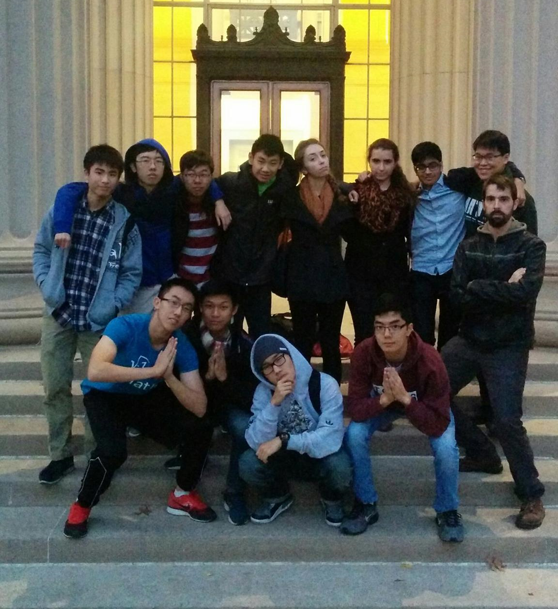

## Introduction
On November 14th, my school sent two teams to the Harvard MIT Math Tournament.
The competition comprised of two individual (General and Theme) rounds and two
team rounds (Team and Guts). The problems were rather difficult, but had very
elegant solutions. Here are two problems that I found interesting.

## Theme Round: Question 8

### Problem Statement

Consider a $8*8$ grid of squares. A rook is placed in the lower left corner,
and every minute it moves to a square in the same row or column with equal
probability (the rook must move; i.e. it cannot stay in the same square). What
is the expected number of minutes until the rook reaches the upper right
corner?

### Solution

Let $A$ represent the set containing point $(8, 8)$, $B$ represent the
set containing the points reachable from $(8,8)$ with one move, and $C$
represent the set containing all other points

Visually, the sets looks like this:

$$
\begin{bmatrix}
  B & B & B & B & B & B & B & A \\
  C & C & C & C & C & C & C & B \\
  C & C & C & C & C & C & C & B \\
  C & C & C & C & C & C & C & B \\
  C & C & C & C & C & C & C & B \\
  C & C & C & C & C & C & C & B \\
  C & C & C & C & C & C & C & B \\
  C & C & C & C & C & C & C & B
\end{bmatrix}
$$

We can make the observation that there are $14$ valid moves from any
position, $2$ ways to get to $B$ from $C$, $7$ ways to get to $A$
from $B$, and $1$ way to get to $A$ from $B$. Using this observation,
we can formulate a series of state transitions.

$$
\begin{aligned}
  E(C \rightarrow B) &= {2 \over 14}  \\\\
  E(C \rightarrow C) &= {12 \over 14} \\\\
  E(B \rightarrow A) &= {1 \over 14}  \\\\
  E(B \rightarrow B) &= {6 \over 14}  \\\\
  E(B \rightarrow C) &= {7 \over 14}  \\\\
\end{aligned}
$$

Using the probabilities of state transitions, we can create equations that
relate the expected value of reaching state $A$ from the other states.

$$
\begin{aligned}
  E(A) &= 0                                                         \\\\
  E(B) &= 1 + {E(A) \over 14} + {6E(B) \over 14} + {7E(C) \over 14} \\\\
  E(C) &= 1 + {2E(B) \over 14} + {12E(C) \over 14}                  \\\\
\end{aligned}
$$

Simplifying:

$$
\begin{aligned}
  8E(B)           &= 14 + 7E(C)                         \\\\
  E(C)            &= 7 + E(B)                           \\\\
  E(C)            &= 7 + {14 \over 8} + {7E(C) \over 8} \\\\
  E(C) \over 8    &= {70 \over 8}                       \\\\
  \therefore E(C) &= 70                                 \\\\
\end{aligned}
$$

## Team Round: Question 9
### Problem Statement

A graph consists of $6$ vertices. For each pair of vertices, a coin is
flipped, and an edge connecting the two vertices is drawn if and only if the
coin shows heads. Such a graph is good if, starting from any vertex $V$
connected to at least one other vertex, it is possible to draw a path starting
and ending at $V$ that traverses each edge exactly once. What is the
probability that the graph is good?

### Solution

If it is possible to draw a path starting at vertex $V$ and ending at
vertex $V$ traversing each edge exactly once, the graph is known as an
*Eulerian graph*. In order for that condition to hold true, every vertex must
have an even degree (I.E. there must be an even number of edges connected to
the vertex). For a graph with six vertexes, we can notice that there are a
couple of graphs which have an Eulerian cycle, but are not good. These graphs
have the two distinct cycles of size three.

There are $\binom{6}{3} * \binom{3}{3} = 20$ graphs with this property.

All that is left is to count the number of labelled Eulerian graphs. We can
make the observation that there is a one-to-one correspondence between the
valid graphs with $n-1$ vertexes and the Eulerian graphs with $n$ vertexes.
For every graph with $n-1$ vertexes, we add a vertex and connect it to all
the vertexes with odd degree. This will produce a valid Eulerian graph because
it forces all the vertexes to have degree two. Notice that there cannot be an
odd number of vertexes with odd degree because the degrees of all the vertexes
must add up to an even number. Thus once we connected the new vertex to all the
odd degree vertexes, the new vertexes will have an even degree.

$$
\begin{aligned}
    \text{\# of Eulerian Graphs} &= 2^{\binom{n-1}{2}}     \\
                                 &= 2^{(n-1)(n-2) \over 2} \\
                                 &= 1024                   \\
    \text{\# of Good Graphs}     &= 1024 - 20              \\
                                 &= 1004                   \\
\end{aligned}
$$
