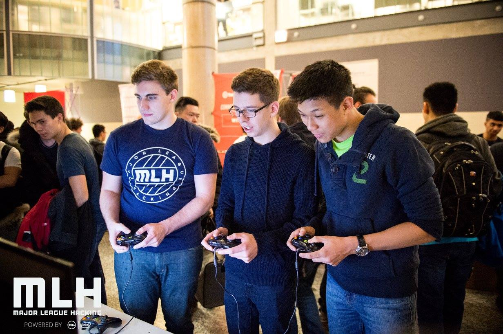
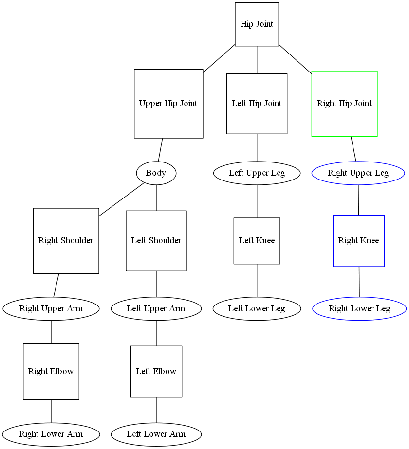

## Introduction

UofTHacks 2016 turned out completely different than I expected. Going into it, I had no idea and
only one teammate (Chris) after my two other teammates cancelled. I thought we were going to build a
very standard and traditional web application, which I was not against because I still need more
practice using the MEAN stack. However, when my teammate and I arrived at the venue, we found a
Waterloo student (Max) that used to go to my high school. After discussing it and attracting other
Waterloo student (Richard), we decided to create a music visualizer with OpenGL with a twist.
Instead of just bars and waveforms, we were going to animate a character/model dancing to the beat
of the music. Sounds ridiculous, right?

## Getting Started

First off, we decided against using OpenGL and switched to WebGL because the team lacked major
experience with C++. Being the one experience with OpenGL, Max went off to learn how to implement
WebGL, while the rest of us thought about the implementation details in JavaScript. We decided on
creating a very elementary model of a human being: some joint and limb objects connected together
where only the joint objects can be rotated. The best way of implementing such a structure would be
to use a tree. The hip joint would be the root of the tree and it would be connected to the
lower-left, lower-right, and upper hip joints which in turned controlled leg and torso rotations.
Logically, there would also be shoulder, knee, and elbow joints that could sufficiently recreate
basic human movement and dancing. A rotation on a joint would "propagated" to all the children
joints. It would look something like this:



If the right hip joint was targeted (green), the rotation would also propagate to the right upper
leg, right knee, and right lower leg (blue). So after we implemented the tree structure of the body,
we also implemented 3D rotations with matrixes.

## three.js

After we had done the heavy lifting with developing the physics engine, Max told us some
disappointing news. It turns out [three.js](http://threejs.org/), a WebGL library, did all the
physics for us. Both fortunate and unfortunate for us. I spent the next chunk of time working with
Max to get all the 3D objects rendered and created. Even with the library, it still took A LOT of
effort setting everything up. Creating all the body parts took at least two hundred lines of code.
After figuring out the inner workings of three.js and setting up the body, we had to figure out how
to move the body. Instead of inverse kinematics, we used forward kinematics because the math was a
lot easier. In essence, we apply impulses to the joints to make the body move. Each body part would
then be slowly forced back to the rest position, similar to how gravity works. So in the middle of
night, Max and I were trying to figure out some Grade 11 Physics equations. Needless to say, we were
very confused. We tried linear, sin, tan, and even square root relations but none of them worked
well. Pseudo-integration didn't work very well because we were calculating the decrease in velocity
in discrete time units, so when a body part would swing back, it wouldn't settle but go faster and
faster. Fortunately, applying a dampening effect (reducing the velocity by 5%) every frame seemed to
do the trick.

The next part was kind of silly. In our sleep deprived states, we decided determine the limits of
each joint in real life. So the next hour was Max and I swinging out arms in every direction and
measuring the limit. Once that was done, we had figured out most of the physics for the body
movements.

## Music

While that was happening, Richard and Chris figured out SoundCloud integration with its
[API](https://developers.soundcloud.com/docs/api/guide) and FFTs with the
[Web Audio API](https://developer.mozilla.org/en-US/docs/Web/API/Web_Audio_API). I quickly put
together a waveform visualization of the SoundCloud music using [chart.js](http://www.chartjs.org/)
and the snapshot amplitudes of frequencies from the FFT in order to debug the movements of our
model. The model was initialized with random movements, so it was very jerky at first. Nevertheless,
it will "reacted" to the bass of the music. Instead of random movements, we decided to incorporate
some common movements for each joint and string them together in order to create seamless dance
moves. The size of each movement also scaled with the amplitude of the music. Here is the code for
two shoulder movements:

```javascript
function shoulder1(amt) {
  if (Math.random() < PROB) {
    vel[RSHOULDER].x -= amt * 2;
    vel[RSHOULDER].y += (Math.random() - 0.5) * amt;
  }
  if (Math.random() < PROB) {
    vel[LSHOULDER].x -= amt * 2;
    vel[LSHOULDER].y += (Math.random() - 0.5) * amt;
  }
}

function shoulder2(amt) {
  if (Math.random() < PROB) {
    vel[RSHOULDER].z += Math.random() / 6 + amt / 2;
  }

  if (Math.random() < PROB) {
    vel[LSHOULDER].z -= Math.random() / 6 + amt / 2;
  }
}
```

At this point, our visualizer was more or less complete. We added a deadmau5 head for jokes and then
added delay for movements that depended on the amplitude so the model would kind of syncopate.

## Conclusion

This hackathon was lots of fun. I was really glad that we decided to create something unique and not
a "standard useful" web application. We didn't expect to win anything with "swagmusic.js", but we
ended being a finalist. Unfortunately, the other projects had a lot more "real-world application"
than ours, so we didn't end up winning any grand prizes. Nevertheless, it was a great experience and
my first dive into WebGL and manipulating audio.

Check out [swagmusic.js](http://xelendt.com/swagmusic/) in action!
