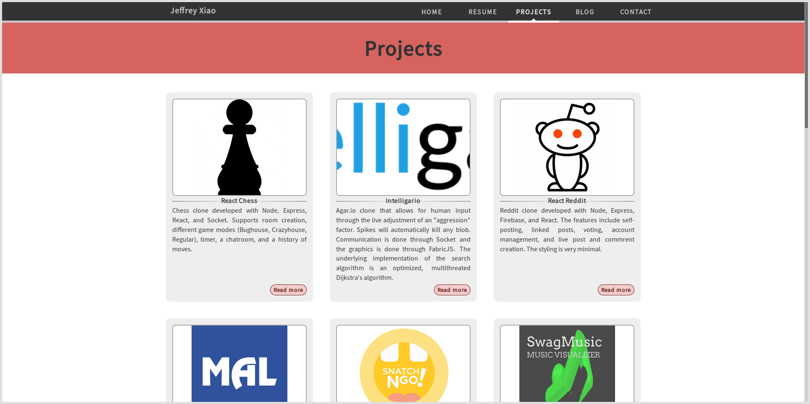

## Introduction

The first version of my personal website was created late 2015 when Angular 1 was one of the most
popular frontend frameworks to use and React was an up-and-comer in the JavaScript land. After three
years of updating content with a homegrown Angular 1 site, I decided to pick up something new and
_reactive_.

## Gatsby

Instead of building my entire site from scratch using React, I wanted to use a pre-existing static
site templator because the majority of my website would consist of a résumé, numerous blog entries,
and various side-projects. One particular static site templator caught my eye — Gatsby. Gatsby
essentially combines all the latest web technologies (React, Webpack, SCSS, etc.) to help you
efficiently scaffold and build out your site. One of the most appealing parts of Gatsby was the
GraphQL layer that you can use while building the site. However, the end result of Gatsby is still
static files. Gatsby is easy to develop with and generates performant static sites.

## Redesign

This time around, I opted for a more minimalistic design. I felt like my old site felt a bit chunky
and messy. Though, I kept most of the content layout.

## GraphQL

The GraphQL layer was extremely handy when building out the redesign. In the Angular 1 version of my
site, most of the data for my projects and blog was maintained as a
[global Angular module](https://github.com/jeffrey-xiao/personal-website-old/blob/master/app/global.js)
so various Angular controllers had access to them. Ultimately, this meant that maintaining it was
rather difficult. Using Gatsby, I was able to extract that data into Markdown or JSON files and then
fetch it using GraphQL when the page needed it.

## Plugins

Another huge improvement gained from using Gatsby was the availability of various plugins. On the
off chance that a plugin that you needed didn't exist, it was incredible easy to create your own and
submit a [PR](https://github.com/gatsbyjs/gatsby/pull/1731). On the other hand, for the Angular 1
version, I either didn't find the plugin I needed or the plugin simply didn't do want I wanted it to
do. As a result, I found myself reinventing the wheel more than once. The
[custom regex-based syntax-highlighter](https://github.com/jeffrey-xiao/personal-website-old/blob/master/app/blog/entry/entryDirective.js)
I built to highlight Java, C++, and Python files was made obsolete with the Prism.js plugin for
Markdown files in Gatsby.

## Performance

After clicking through both versions of my personal site side-by-side, Gatsby is definitely much
more performant and snappy compared to Angular 1. One of the big performance optimizations that
Gatsby does is that it
[generates](https://github.com/jeffrey-xiao/personal-website-old/blob/gatsby/gatsby-node.js) a JSON
file for each route, only one file will be fetched per route, and React.js can use its virtual DOM
to efficiently rerender the page. Routing in Angular 1, however, is done dynamically. For example,
when the user requests `/blog/1`, the
[blog controller](https://github.com/jeffrey-xiao/personal-website-old/blob/master/app/blog/blogController.js)
would generate the necessary data to pass to the blog view.

## Final Thoughts

Switching to Gatsby instead of maintaining the Angular 1 version of my site was definitely the sane
choice to make. Gatsby makes static site generation painless and creates a performant single page
application.
